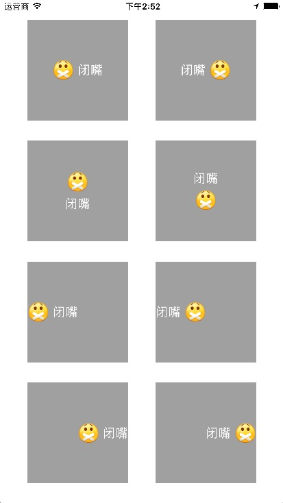

# UUButton

[](https://raw.githubusercontent.com/CheeryLau/UUButton/master/LICENSE)&nbsp;
[](https://cocoapods.org/pods/UUButton)&nbsp;
[](https://cocoapods.org/pods/UUButton)&nbsp;



## 安装 [CocoaPods]

1. `pod "UUButton"`;
2. `pod install` / `pod update`;
3. `#import <UUButton.h>`.

## 使用说明

`UUButton`继承于`UIButton`，枚举内容(图片和文字)对齐方式，简化使用。用法和`UIButton`相同，只不过加了以下两个属性：

```objc
// 对齐方式
@property (nonatomic, assign) UUContentAlignment contentAlignment;
// 图文间距[默认5.0]
@property (nonatomic, assign) CGFloat spacing;
```

```objc
// 枚举
typedef NS_ENUM(NSInteger, UUContentAlignment) {
    UUContentAlignmentNormal = 0,                       //内容居中>>图左文右
    UUContentAlignmentCenterImageRight,                 //内容居中>>图右文左
    UUContentAlignmentCenterImageTop,                   //内容居中>>图上文右
    UUContentAlignmentCenterImageBottom,                //内容居中>>图下文上
    UUContentAlignmentLeftImageLeft,                    //内容居左>>图左文右
    UUContentAlignmentLeftImageRight,                   //内容居左>>图右文左
    UUContentAlignmentRightImageLeft,                   //内容居右>>图左文右
    UUContentAlignmentRightImageRight                   //内容居右>>图右文左
};
```

## 后记

如有问题，欢迎给我[留言](https://github.com/CheeryLau/UUButton/issues)，如果这个工具对你有些帮助，请给我一个star，谢谢。😘😘😘😘

💡 💡 💡 
欢迎访问我的[主页](https://github.com/CheeryLau)，希望以下工具也会对你有帮助。

1、自定义视频采集/图像选择及编辑/音频录制及播放等：[MediaUnitedKit](https://github.com/CheeryLau/MediaUnitedKit)

2、类似滴滴出行侧滑抽屉效果：[MMSideslipDrawer](https://github.com/CheeryLau/MMSideslipDrawer)

3、图片选择器基于AssetsLibrary框架：[MMImagePicker](https://github.com/CheeryLau/MMImagePicker)

4、图片选择器基于Photos框架：[MMPhotoPicker](https://github.com/CheeryLau/MMPhotoPicker)

5、webView支持顶部进度条和侧滑返回:[MMWebView](https://github.com/CheeryLau/MMWebView)

6、多功能滑动菜单控件：[MenuComponent](https://github.com/CheeryLau/MenuComponent)

7、仿微信朋友圈：[MomentKit](https://github.com/CheeryLau/MomentKit)

8、图片验证码：[MMCaptchaView](https://github.com/CheeryLau/MMCaptchaView)

9、源生二维码扫描与制作：[MMScanner](https://github.com/CheeryLau/MMScanner)

10、简化UIButton文字和图片对齐：[UUButton](https://github.com/CheeryLau/UUButton)

11、基础组合动画：[CAAnimationUtil](https://github.com/CheeryLau/CAAnimationUtil)

